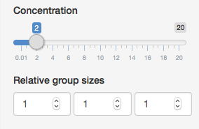
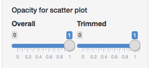
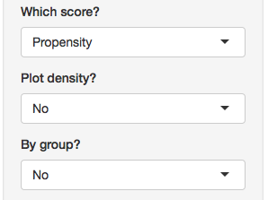
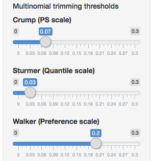

More detailed explanations are found in the eAppendix Section 3.4.

**Simulated data parameters**

The propensity score vector of three elements are simulated from the Dirichlet distribution.

*Sample size* determines the sample size of the entire cohort simulated. The Dirichlet distribution is parametrized as by three concentration parameters. In this web application, concentration parameters are products of a single common *Concentration* and *Relative group sizes*. A smaller *Concentration* value gives a more separated distribution of the PS and treatment groups (poor PS overlap). A larger *Concentration* value gives a more concentrated distribution of the PS and treatment groups (good PS overlap).

**Plotting parameters**

*Opacity Overall* controls the fading of the points in each scatter plot. *Opacity Trimmed* can be used to further fade points outside the trimming region.

Choosing Preference in *Which score?* changes the scale to the preference score. Choosing Yes in *Plot density* results in a contour plot instead of a scatter plot. Selecting Yes in *By group* separates groups into three panels.

**Trimming parameters**

*Multinomial trimming thresholds* controls the trimming threshold for each method. The default values are the tentative values for the three-group setting stated in the eAppendix. The trimming boundaries are shown visually for each method. The proportion of data points retained (overall and by group) are displayed above each plot.

