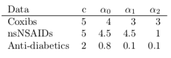

The empirical datasets mentioned in the paper cannot be disclosed due to the data use agreements. Instead, we made this interactive web application available with a simplistic PS distribution simulation. The source code is available at [Github](https://github.com/kaz-yos/shiny-trim-ternary).

**Background**

The distribution of three-group PS $\boldsymbol{e}_{i} = (e_{0i},e_{1i},e_{2i})^{T}$ where $e_{0i} + e_{1i} + e_{2i} = 1$ is simulated from a Dirichlet distribution $\text{Dirichlet}(c\alpha_{0}, c\alpha_{1}, c\alpha_{2})$. The Dirichlet distribution is a multivariate generalization of the beta distribution. Treatment assignment $A_{i}$ is then chosen as 0, 1, or 2 based on $\boldsymbol{e}_{i}$, which is the treatment assignment probability.

**Simulated data parameters**

*Sample size* determines the sample size of the entire cohort simulated.

*Concentration* is $c$ and *Relative group sizes* are $\alpha_{0}, \alpha_{1}$, and $\alpha_{2}$.  A smaller *Concentration* value gives a more separated distribution of the PS and treatment groups (poor PS overlap). A larger *Concentration* value gives a more concentrated distribution of the PS and treatment groups (good PS overlap).

**Plotting parameters**

*Opacity Overall* controls the fading of the points in each scatter plot. *Opacity Trimmed* can be used to further fade points outside the trimming region.

Choosing Preference in *Which score?* changes the scale to the preference score. Choosing Yes in *Plot density* results in a contour plot instead of a scatter plot. Selecting Yes in *By group* separates groups into three panels.

**Trimming parameters**

*Multinomial trimming thresholds* controls the trimming threshold for each method. The default values are the tentative values for the three-group setting stated in the paper. The trimming boundaries are shown visually for each method. The proportion of data points retained (overall and by group) are displayed above each plot.

**Emulation of empirical examples**

The following setting of *Concentration* *c* and *Relative group sizes* (alphas) gives approximation to the empirical data presented in the paper. They were derived from the MLE assuming a Dirichlet distribution and manual adjustment for visual similarity.

