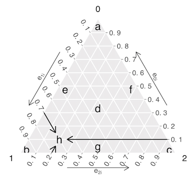
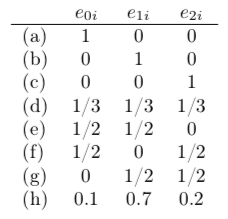

**Ternary plot**

Each triangular panel is an instance of a *ternary plot*. A ternary plot is a triangle-shaped two-dimensional representation of three-dimensional data that sum to a constant. It is sufficient to understand that a point distant from a corner, for example, far from the top corner labeled 0, represents an individual with a low probability of being in group 0. The mid-point represents an individual with equal probabilities (0.33) for all three groups.

**Ternary plot with fully annotated axes**

The points in the plot above represent the following values. See the eAppendix for the explanation of how to look up point (h).

